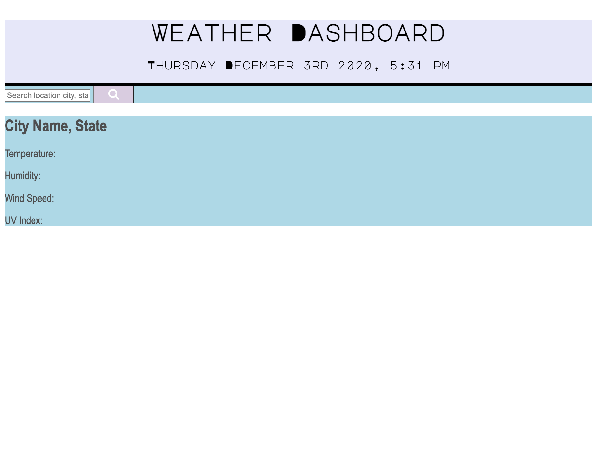

# WeatherDashboard_API

## Description 

This application consists of a weather dashboard that runs in the browser and features dynamically updated HTML and CSS. Using the OpenWeather API, this retrieves data from any city typed in the search bar, and will save favorite cities/frequently used cities in localStorage as well as on the page after it is refreshed.

Given the user wants to check the current weather for multiple cities so they can better plan their trip. This application will inform the user on current and future weather conditions for the city they input, and it will be added to search history for easy access to check again. When the user searchers a city, they are also presented with :

    • City name
    • Current date
    • An icon representation of weather conditions
    • Wind speed
    • Humidity
    • Temperature
    • UV Index

When viewing the UV index option, different colors will indicate the conditions--favorable will be in a pastel green, moderate in a yellow color and severe will be in a hazardous red color.

Like most weather applications, the user will be provided with a 5-day forecast with the dates associated with the weather conditions (temperature, humidity, wind speed, etc.) Each time the weather dashboard is opened, the user is presented with the forecast of the last city searched.

## Installation

Type in a specific city to search for that weeks weather forecast.

[Click here to deploy application](https://nsc9605.github.io/WeatherDashboard_API/)

## Tech/Framework Used

Built with

•VS Code

## Usage/Demo Screenshot

<!-- Screenshot will go here -->

## License

MIT © 2020 Nicole Catapano

